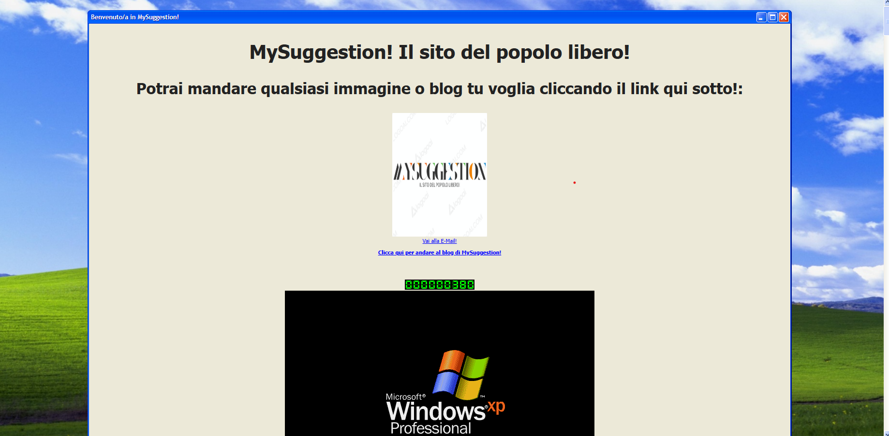

<h3 align="center">𝘽𝙚𝙣𝙫𝙚𝙣𝙪𝙩𝙞 𝙣𝙚𝙡𝙡𝙖 𝙧𝙚𝙥𝙤 𝙙𝙞 𝙈𝙮𝙎𝙪𝙜𝙜𝙚𝙨𝙩𝙞𝙤𝙣!</h3>

Qui troverete i file che compongono il sito <a href="https://mineyyt.github.io">MySuggestion!</a>

  

----
 

----

<a href="index.html">MySuggestion Home</a> - Qui troverai il codice della pagina principale!

<a href="blog.html">MySuggestion Blog</a> - Qui troverai il codice della pagine del blog!

ー═┻┳︻▄ξ(╬ಠ益ಠ)ξ▄︻┻┳═一

  

----
<h3 align="center">𝙋𝙧𝙚𝙫𝙞𝙚𝙬 𝙙𝙚𝙡 𝙨𝙞𝙩𝙤</h3>

